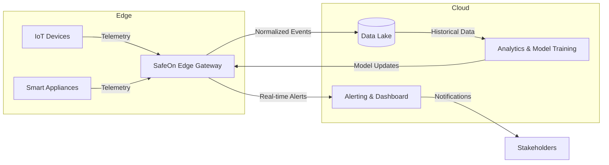

# SafeOn
**The Anomaly Detection Framework for Smart Home IoT Security With Digital Twin**

---

## Project Overview
SafeOn safeguards smart-home environments by combining edge-based anomaly detection with privacy-aware data governance. Telemetry from diverse IoT devices is collected by the SafeOn edge gateway, analyzed with hybrid rule-based and machine-learning models, and synchronized with centralized analytics services. The framework emphasizes rapid response, forensic visibility, and minimal exposure of personal data.

### Key Capabilities
- **Comprehensive Device Coverage:** Supports environmental sensors, security devices, smart appliances, and wearables while enforcing secure onboarding and telemetry standards.
- **Hybrid Analytics Pipeline:** Blends rule engines, Isolation Forest, and LSTM models to detect both instantaneous anomalies and long-term behavioral deviations.
- **Privacy-Preserving Operations:** Implements encryption, role-based access control, and data minimization to align with regulatory expectations (e.g., GDPR).
- **Actionable Response:** Generates real-time alerts, isolates compromised devices, and provides audit trails for incident investigations.

## System Architecture

## Documentation
- [IoT Device Requirements](docs/requirements.md)
- [Threat Model](docs/threat_model.md)

## Project Proposal
The Internet of Things (IoT) has rapidly transformed modern homes into highly connected environments, integrating devices such as cameras, smart locks, vacuum robots, and household appliances.

In this study, we propose a smart home security framework based on an edge device Detection and Response approach rule-based detection, and machine learning techniques such as IsolationForest for instant anomalies and LSTM for temporal behavioral analysis.

The system provides real-time alerts, logs forensic evidence, and demonstrates a practical, privacy-preserving approach to safeguarding IoT devices in everyday home environments.

Through SafeOn, we can make a practical, scalable, and privacy-conscious approach to securing IoT devices against increasingly sophisticated cyber threats.

---

## Group Members
| Name | Organization | Email |
|------|-------------|--------|
| Juseong Jeon | Department of Information Systems, Hanyang University | hyu22ix@hanyang.ac.kr |
| Jaemin Jung | Department of Information Systems, Hanyang University | woals5633@hanyang.ac.kr |
| Wonyoung Shin | Department of Information Systems, Hanyang University | pingu090@hanyang.ac.kr |
| Seungmin Son | Department of Information Systems, Hanyang University | andyson0205@gmail.com |
